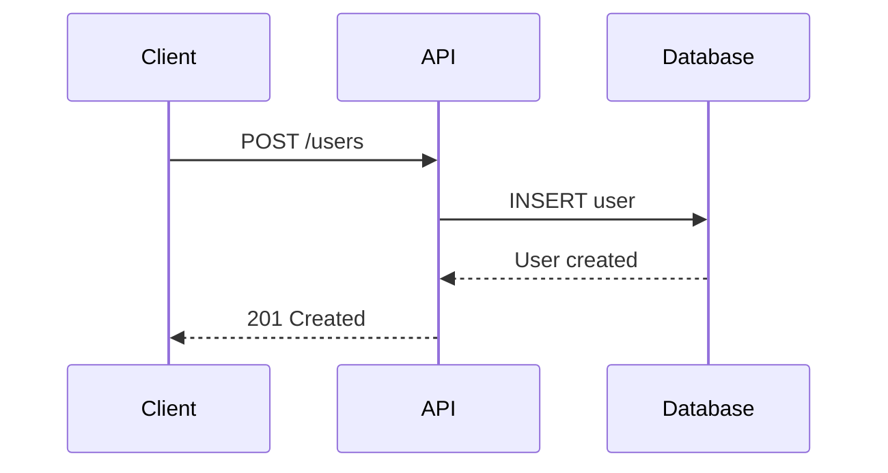

# Document Writing Skills

**Purpose**: This skill provides comprehensive document writing patterns, templates, and best practices that agents can apply when generating professional documentation, reports, contracts, guides, and technical writing across various domains.

## When to Use Document Writing Skills

Use this skill when:
- Creating API documentation (REST/GraphQL/RPC)
- Writing technical documentation or user guides
- Generating research reports or incident reports
- Drafting architecture decision records (ADRs)
- Creating changelogs and release notes
- Writing legal memoranda or contracts
- Producing test reports or security assessments
- Authoring product requirement documents (PRDs)

## Core Writing Principles

### 1. Clarity and Conciseness

**Guidelines**:
- Use active voice: "The system processes requests" (not "Requests are processed by the system")
- Use present tense: "The function returns" (not "The function will return")
- Be specific: "Response time: 200ms" (not "Response time is fast")
- Avoid jargon unless domain-appropriate
- Use short sentences (15-20 words maximum)
- Break complex ideas into numbered steps

**Example - Before and After**:
```
❌ Before: "It should be noted that the API endpoint might be utilized for the purpose of retrieving user data."
✅ After: "Use this endpoint to retrieve user data."
```

### 2. Progressive Disclosure Structure

Organize documents from high-level to detailed:
1. **Summary/Overview** - What and why (2-3 sentences)
2. **Key Concepts** - Essential understanding
3. **Details** - Deep-dive information
4. **Reference** - Complete specifications

**Template**:
```markdown
# Document Title

## Summary
[2-3 sentences: What this is and why it matters]

## Quick Start
[Minimal steps to get started]

## Concepts
[Essential understanding]

## Detailed Guide
[In-depth information]

## Reference
[Complete specifications, API details, etc.]
```

### 3. Consistency Standards

**Maintain consistency in**:
- Terminology (create glossary for domain terms)
- Code formatting (use syntax highlighting)
- Section structure (follow templates)
- Date formats (ISO 8601: YYYY-MM-DD)
- Version numbers (Semantic Versioning: MAJOR.MINOR.PATCH)

---

## Document Type Templates

### API Documentation

**Structure**:
```markdown
# API Endpoint: [Method] /path/to/endpoint

## Overview
[Brief description of what this endpoint does]

## Authentication
[Required authentication method]

## Request

**Method**: [GET/POST/PUT/DELETE]
**URL**: `/api/v1/endpoint`

**Headers**:
| Header | Value | Required |
|--------|-------|----------|
| Authorization | Bearer {token} | Yes |
| Content-Type | application/json | Yes |

**Parameters**:
| Parameter | Type | Required | Description |
|-----------|------|----------|-------------|
| user_id | integer | Yes | Unique user identifier |
| limit | integer | No | Max results (default: 10) |

**Request Body** (JSON):
```json
{
  "field1": "value",
  "field2": 123
}
```

## Response

**Success Response** (200 OK):
```json
{
  "status": "success",
  "data": {
    "id": 12345,
    "name": "Example"
  }
}
```

**Error Responses**:
| Status Code | Description | Response Body |
|-------------|-------------|---------------|
| 400 | Bad Request | `{"error": "Invalid parameters"}` |
| 401 | Unauthorized | `{"error": "Authentication required"}` |
| 404 | Not Found | `{"error": "Resource not found"}` |
| 500 | Server Error | `{"error": "Internal server error"}` |

## Example Usage

**cURL**:
```bash
curl -X POST https://api.example.com/v1/endpoint \
  -H "Authorization: Bearer YOUR_TOKEN" \
  -H "Content-Type: application/json" \
  -d '{"field1": "value"}'
```

**Python**:
```python
import requests

response = requests.post(
    "https://api.example.com/v1/endpoint",
    headers={"Authorization": "Bearer YOUR_TOKEN"},
    json={"field1": "value"}
)
```

## Rate Limiting
[Rate limit details if applicable]

## Notes
[Additional considerations, edge cases, deprecation warnings]
```

### Technical Report

**Structure**:
```markdown
# [Report Title]

**Author**: [Name/Role]
**Date**: [YYYY-MM-DD]
**Version**: [X.Y]
**Status**: [Draft/Final/Approved]

## Executive Summary
[2-3 paragraphs: Key findings, recommendations, impact]

## Background
[Context: Why this report exists, what problem it addresses]

## Methodology
[How the analysis was conducted, tools used, data sources]

## Findings

### Finding 1: [Title]
**Impact**: [High/Medium/Low]
**Evidence**: [Data, observations, metrics]
**Analysis**: [What this means]

### Finding 2: [Title]
[Same structure...]

## Recommendations

### Recommendation 1: [Action]
**Priority**: [High/Medium/Low]
**Effort**: [High/Medium/Low]
**Timeline**: [Timeframe]
**Rationale**: [Why this recommendation]

## Conclusion
[Summary of key points and next steps]

## Appendix
[Supporting data, detailed tables, raw results]
```

### Architecture Decision Record (ADR)

**Structure**:
```markdown
# ADR-[Number]: [Title]

**Status**: [Proposed/Accepted/Deprecated/Superseded]
**Date**: [YYYY-MM-DD]
**Deciders**: [Names/Roles]

## Context
[What is the issue we're addressing?]

## Decision
[What decision have we made?]

## Rationale
[Why did we make this decision?]

### Options Considered

#### Option 1: [Name]
**Pros**:
- [Advantage 1]
- [Advantage 2]

**Cons**:
- [Disadvantage 1]
- [Disadvantage 2]

#### Option 2: [Name]
[Same structure...]

### Decision Criteria
- [Criterion 1: Performance]
- [Criterion 2: Maintainability]
- [Criterion 3: Cost]

## Consequences

### Positive
- [Benefit 1]
- [Benefit 2]

### Negative
- [Trade-off 1]
- [Trade-off 2]

### Neutral
- [Impact 1]

## Implementation Notes
[Guidance for implementing this decision]

## Related Decisions
- [ADR-XXX: Related decision]

## References
- [Documentation links, research papers, discussions]
```

### User Guide

**Structure**:
```markdown
# [Product/Feature] User Guide

## Overview
[What this is and what it helps users accomplish]

## Getting Started

### Prerequisites
- [Requirement 1]
- [Requirement 2]

### Installation
1. [Step 1 with validation]
   ```bash
   command-to-run
   ```
   **Expected output**: [What success looks like]

2. [Step 2]
   [Validation checkpoint]

## Tutorials

### Tutorial 1: [Basic Task]
**Goal**: [What you'll accomplish]
**Time**: [Estimated duration]

**Steps**:
1. [Action]
   - **Why**: [Rationale]
   - **Validation**: [How to verify success]

2. [Next action]
   [Same structure...]

**Result**: [What you've achieved]

### Tutorial 2: [Advanced Task]
[Same structure...]

## Reference

### Feature 1
**Description**: [What it does]
**Usage**: [How to use it]
**Parameters**: [Options available]
**Examples**: [Common use cases]

## Troubleshooting

### Problem: [Common issue]
**Symptoms**: [How to identify this problem]
**Cause**: [Why this happens]
**Solution**: [Step-by-step fix]

### Problem: [Another issue]
[Same structure...]

## FAQ

**Q: [Common question]**
A: [Clear answer]

## Additional Resources
- [Link to API docs]
- [Link to community forum]
```

### Changelog

**Format**: Keep a Changelog (https://keepachangelog.com/en/1.0.0/)

**Structure**:
```markdown
# Changelog

All notable changes to this project will be documented in this file.

The format is based on [Keep a Changelog](https://keepachangelog.com/en/1.0.0/),
and this project adheres to [Semantic Versioning](https://semver.org/spec/v2.0.0.html).

## [Unreleased]

### Added
- [New feature description]

### Changed
- [Change to existing functionality]

### Deprecated
- [Soon-to-be removed feature]

### Removed
- [Removed feature]

### Fixed
- [Bug fix]

### Security
- [Vulnerability fix]

## [1.2.0] - 2025-11-08

### Added
- User authentication with JWT tokens
- Password reset functionality
- Email verification

### Changed
- Improved API response times by 40%
- Updated database schema for better performance

### Fixed
- Issue #123: Login timeout on slow connections
- Memory leak in background worker

## [1.1.0] - 2025-10-15

[Previous version changes...]

## [1.0.0] - 2025-09-01

### Added
- Initial release
- User registration and login
- Basic profile management

[Unreleased]: https://github.com/org/repo/compare/v1.2.0...HEAD
[1.2.0]: https://github.com/org/repo/compare/v1.1.0...v1.2.0
[1.1.0]: https://github.com/org/repo/compare/v1.0.0...v1.1.0
[1.0.0]: https://github.com/org/repo/releases/tag/v1.0.0
```

**Breaking Changes Callout**:
```markdown
## [2.0.0] - 2025-11-08

### ⚠️ BREAKING CHANGES
- **Authentication**: Changed from session-based to JWT tokens
  - **Migration**: See [Migration Guide](./MIGRATION.md)
  - **Impact**: All clients must update authentication flow
- **API Endpoints**: Removed deprecated `/v1/users` endpoint
  - **Replacement**: Use `/v2/users` instead
```

---

## Visual Elements

### Code Examples

**Always include**:
- Syntax highlighting (specify language)
- Complete working examples (not fragments)
- Expected output
- Error handling

**Template**:
````markdown
```python
# Complete example with imports
import requests

def get_user(user_id):
    """Retrieve user by ID."""
    try:
        response = requests.get(f"https://api.example.com/users/{user_id}")
        response.raise_for_status()
        return response.json()
    except requests.exceptions.RequestException as e:
        print(f"Error: {e}")
        return None

# Usage
user = get_user(123)
print(user)
```

**Expected output**:
```json
{
  "id": 123,
  "name": "John Doe",
  "email": "john@example.com"
}
```
````

### Diagrams

**When to include**:
- Architecture overviews
- Data flow diagrams
- State machines
- Process workflows

**Formats**:
- Mermaid (for text-based diagrams in Markdown)
- ASCII art (for simple diagrams)
- Image files (for complex visuals)

**Mermaid Example**:
````markdown

````

### Tables

**Use tables for**:
- Parameter specifications
- Configuration options
- Comparison matrices
- Error code listings

**Best practices**:
- Include headers
- Align columns consistently
- Use separators for readability
- Keep cell content concise

---

## Domain-Specific Patterns

### Legal Documents

**Key requirements**:
- Formal tone and precise language
- Numbered sections and subsections
- Citation formatting (jurisdiction-specific)
- Definitions section
- Signature blocks

**Reference**: See `references/legal-document-patterns.md` for:
- Contract templates
- Memorandum structure
- Citation formats (Finlex, EUR-Lex, Bluebook, etc.)
- Legal writing conventions

### Security Reports

**Structure**:
- Executive summary with risk scores
- CVSS scoring for vulnerabilities
- STRIDE/OWASP categorization
- Remediation guidance with timelines
- Evidence and proof-of-concept

**Reference**: See `references/security-report-patterns.md` for:
- Vulnerability report template
- Threat modeling documentation
- Penetration test report structure
- Security assessment framework

### Product Requirements Document (PRD)

**Structure**:
- Product overview and goals
- User personas and use cases
- Functional requirements
- Non-functional requirements
- Success metrics
- Release criteria

**Reference**: See `references/prd-patterns.md` for:
- Complete PRD template
- Feature prioritization frameworks (RICE, MoSCoW)
- User story formats
- Acceptance criteria patterns

---

## Quality Checklist

Before finalizing any document, verify:

**Content Quality**:
- [ ] Purpose is clear in first paragraph
- [ ] All technical terms are defined or linked
- [ ] Examples are complete and tested
- [ ] No assumptions about reader knowledge
- [ ] Consistent terminology throughout

**Structure Quality**:
- [ ] Logical flow from high-level to detailed
- [ ] Table of contents for long documents (>5 sections)
- [ ] Clear section headings
- [ ] Appropriate use of lists vs paragraphs
- [ ] Progressive disclosure applied

**Technical Quality**:
- [ ] Code examples use syntax highlighting
- [ ] All code has been validated
- [ ] API endpoints include full URL
- [ ] Error codes are documented
- [ ] Links are valid and versioned

**Accessibility**:
- [ ] Headings use proper hierarchy (H1 > H2 > H3)
- [ ] Tables have descriptive headers
- [ ] Images have alt text
- [ ] Color is not the only indicator
- [ ] Contrast ratios meet WCAG AA standards

**Metadata**:
- [ ] Document has creation date (ISO 8601)
- [ ] Author/owner is identified
- [ ] Version number is specified
- [ ] Last updated date is current
- [ ] Status is indicated (Draft/Final/Deprecated)

---

## Advanced Patterns

For detailed guidance on specialized documentation types, see:

- **Legal Document Patterns**: `references/legal-document-patterns.md`
  - Contract templates (employment, service agreements, NDAs)
  - Legal memorandum structure
  - Citation formats by jurisdiction
  - Finnish/EU legal writing conventions

- **Security Report Patterns**: `references/security-report-patterns.md`
  - Vulnerability disclosure templates
  - Threat modeling documentation
  - Penetration test report structure
  - CVSS scoring guidance

- **Product Document Patterns**: `references/prd-patterns.md`
  - Product requirement documents (PRDs)
  - Feature specification templates
  - User story and acceptance criteria formats
  - Prioritization frameworks (RICE, MoSCoW, Kano)

- **Technical Writing Best Practices**: `references/technical-writing-guide.md`
  - Style guide recommendations
  - Grammar and punctuation rules
  - Localization considerations
  - Inclusive language guidelines

---

## Summary

This skill provides comprehensive patterns and templates for creating professional documentation across multiple domains. Apply these patterns to ensure consistency, clarity, and quality in all written deliverables.

**Key Principles**:
1. **Clarity**: Active voice, present tense, specific language
2. **Structure**: Progressive disclosure from high-level to detailed
3. **Consistency**: Templates, terminology, formatting
4. **Completeness**: Examples, error handling, validation
5. **Quality**: Verified code, tested links, proper metadata
