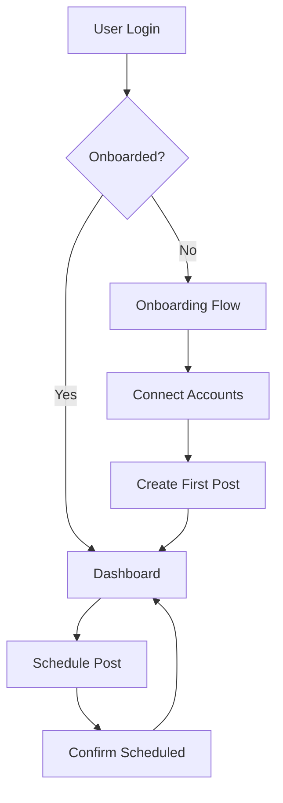
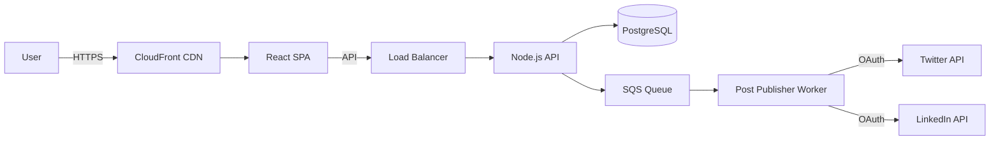

# Product Requirements Document (PRD) Patterns

This reference provides templates and patterns for product requirement documents, feature specifications, and user stories.

## Product Requirements Document (PRD)

### Standard Template

```markdown
# PRD: [Feature/Product Name]

**Version**: [X.Y]
**Date**: [YYYY-MM-DD]
**Status**: [Draft/Review/Approved/In Development]
**Owner**: [Product Manager Name]

---

## Executive Summary

[2-3 paragraph overview: What is being built, why it matters, expected impact]

**Key Metrics**:
- Target: [X]% increase in [metric]
- Timeline: [X] weeks
- Investment: [X] person-weeks

---

## Problem Statement

### Current Situation
[Description of the current state and pain points]

### User Pain Points
1. **Pain Point 1**: [Specific user problem]
   - **Evidence**: [User research, support tickets, analytics]
   - **Frequency**: [How often this occurs]
   - **Impact**: [Business/user impact]

2. **Pain Point 2**: [Another problem]
   [Same structure...]

### Why Now?
[Why is this the right time to build this feature?]
- Market opportunity
- Competitive pressure
- Strategic alignment

---

## Goals and Success Metrics

### Business Goals
1. **Increase conversion rate** from [X]% to [Y]%
2. **Reduce churn** by [X]%
3. **Improve NPS** from [X] to [Y]

### User Goals
1. Enable users to [accomplish task] in <[X] steps
2. Reduce time to [complete action] by [X]%

### Success Metrics (OKRs)

**Objective 1**: Improve user onboarding experience

**Key Results**:
- KR1: Reduce time-to-first-value from 10 min to 3 min
- KR2: Increase activation rate from 45% to 65%
- KR3: Achieve NPS >50 for new users

**Measurement**:
- Analytics: Mixpanel onboarding funnel
- Survey: NPS survey after 7 days

---

## User Personas

### Primary Persona: Marketing Manager Mary

**Demographics**:
- Age: 32-45
- Role: Marketing Manager at mid-size B2B company
- Experience: 5-10 years in marketing

**Goals**:
- Track campaign performance across channels
- Prove marketing ROI to executives
- Automate repetitive reporting tasks

**Pain Points**:
- Spends 10 hours/week on manual reporting
- Data scattered across multiple tools
- Can't easily show attribution

**Tech Savviness**: Medium (comfortable with SaaS tools, not technical)

**Quote**: "I need to show my CEO that marketing drives revenue, but I spend more time collecting data than analyzing it."

### Secondary Persona: Data Analyst Dan
[Same structure...]

---

## User Stories and Use Cases

### Epic: Social Media Scheduling

#### User Story 1: Schedule a Post
**As a** marketing manager
**I want to** schedule social media posts in advance
**So that** I can maintain consistent posting without manual work

**Acceptance Criteria**:
- [ ] User can select date and time for post
- [ ] User can select multiple social platforms (Twitter, LinkedIn, Facebook)
- [ ] User can preview post for each platform
- [ ] User receives confirmation when post is scheduled
- [ ] User can edit or delete scheduled posts
- [ ] System sends notification if post fails

**Definition of Done**:
- [ ] All acceptance criteria met
- [ ] Unit tests written and passing
- [ ] Integration tests passing
- [ ] UI reviewed and approved
- [ ] Documentation updated
- [ ] Security review completed

---

#### User Story 2: Bulk Upload Posts
[Same structure...]

### Use Case: First-Time User Onboarding

**Actor**: New user (Marketing Manager Mary)

**Preconditions**:
- User has signed up for account
- User has not completed onboarding

**Main Flow**:
1. User logs in for first time
2. System presents welcome screen
3. System prompts user to connect social media accounts
4. User selects Twitter and authorizes connection
5. System imports recent posts for preview
6. System prompts user to schedule first post
7. User creates and schedules post
8. System shows success message and onboarding completion

**Alternate Flows**:
- **3a**: User skips connecting accounts → System allows manual posting
- **6a**: User skips scheduling → System shows empty dashboard with CTA

**Postconditions**:
- User is marked as "activated"
- User sees populated dashboard

---

## Functional Requirements

### FR1: Post Scheduling
**Priority**: P0 (Must Have)
**Status**: Approved

**Description**: Users can schedule social media posts for future publication.

**Requirements**:
1. User shall be able to select date and time (timezone-aware)
2. System shall support scheduling up to 12 months in advance
3. User shall be able to schedule same content to multiple platforms
4. System shall show scheduled posts in calendar view
5. User shall receive notification 1 hour before post publishes

**Out of Scope**:
- AI-generated post suggestions (future release)
- Video editing (use external tools)

---

### FR2: Analytics Dashboard
[Same structure...]

---

## Non-Functional Requirements

### Performance
- **Page Load Time**: <2 seconds (p95)
- **API Response Time**: <500ms (p95)
- **Concurrent Users**: Support 10,000 simultaneous users
- **Scheduled Posts**: Handle 1M+ posts per day

### Security
- **Authentication**: OAuth 2.0 with social platforms
- **Data Encryption**: AES-256 at rest, TLS 1.3 in transit
- **Access Control**: Role-based (Admin, Editor, Viewer)
- **Compliance**: GDPR, SOC 2 Type II

### Scalability
- Horizontal scaling for API servers
- Database read replicas for analytics queries
- CDN for static assets

### Reliability
- **Uptime SLA**: 99.9% (excluding scheduled maintenance)
- **RTO**: 4 hours
- **RPO**: 1 hour
- **Backup**: Daily full backup, hourly incremental

### Usability
- **Mobile-Responsive**: Support desktop, tablet, mobile
- **Accessibility**: WCAG 2.1 AA compliance
- **Internationalization**: Support English, Spanish, German, French
- **Browser Support**: Chrome (last 2), Firefox (last 2), Safari (last 2)

---

## User Experience

### User Flow Diagram


### Wireframes
[Link to Figma/Sketch files]

**Key Screens**:
1. **Dashboard**: Overview of scheduled posts and analytics
2. **Post Composer**: Create and schedule posts
3. **Calendar View**: See all scheduled posts in calendar
4. **Analytics**: Performance metrics and insights

### Design Principles
- **Simplicity**: Minimize clicks to complete tasks
- **Clarity**: Clear labels and feedback
- **Consistency**: Familiar patterns (similar to Twitter/LinkedIn UX)
- **Forgiveness**: Easy undo for destructive actions

---

## Technical Architecture

### High-Level Architecture


### Technology Stack
- **Frontend**: React 18, TypeScript, Tailwind CSS
- **Backend**: Node.js (Express), TypeScript
- **Database**: PostgreSQL 15
- **Queue**: AWS SQS
- **CDN**: AWS CloudFront
- **Hosting**: AWS ECS (Fargate)

### Data Model (Simplified)

```sql
Table: users
- id (UUID, primary key)
- email (string, unique)
- created_at (timestamp)

Table: social_accounts
- id (UUID, primary key)
- user_id (UUID, foreign key)
- platform (enum: twitter, linkedin, facebook)
- oauth_token (encrypted string)
- connected_at (timestamp)

Table: posts
- id (UUID, primary key)
- user_id (UUID, foreign key)
- content (text)
- scheduled_at (timestamp)
- status (enum: draft, scheduled, published, failed)
- created_at (timestamp)

Table: post_publishes
- id (UUID, primary key)
- post_id (UUID, foreign key)
- social_account_id (UUID, foreign key)
- platform_post_id (string, nullable)
- published_at (timestamp, nullable)
- status (enum: pending, published, failed)
```

### API Endpoints

**POST /api/v1/posts**
- Create and schedule a post
- Authentication: Required (JWT)
- Rate Limit: 100 requests/minute

**GET /api/v1/posts**
- Retrieve user's posts
- Pagination: 20 posts per page
- Filters: status, platform, date range

[See API documentation for complete spec]

---

## Prioritization

### RICE Scoring

| Feature | Reach | Impact | Confidence | Effort | RICE Score |
|---------|-------|--------|------------|--------|------------|
| Post Scheduling | 1000 | 3 | 100% | 4 | 750 |
| Analytics Dashboard | 800 | 2 | 80% | 6 | 213 |
| Bulk Upload | 200 | 3 | 90% | 2 | 270 |
| AI Suggestions | 500 | 3 | 50% | 8 | 94 |

**Reach**: Users affected per quarter
**Impact**: Scale of 1-3 (Massive=3, High=2, Medium=1, Low=0.5, Minimal=0.25)
**Confidence**: Percentage (100%, 80%, 50%)
**Effort**: Person-weeks

**Priority Order** (by RICE):
1. Post Scheduling (750)
2. Bulk Upload (270)
3. Analytics Dashboard (213)
4. AI Suggestions (94)

### MoSCoW Prioritization

**Must Have (P0)**:
- Post scheduling
- Calendar view
- Basic analytics

**Should Have (P1)**:
- Bulk upload
- Post templates
- Mobile app

**Could Have (P2)**:
- AI post suggestions
- Sentiment analysis
- Competitor tracking

**Won't Have (This Release)**:
- Video editing
- Influencer collaboration
- White-label solution

---

## Dependencies

### Internal Dependencies
- **Design Team**: Wireframes by [YYYY-MM-DD]
- **Backend Team**: API endpoints by [YYYY-MM-DD]
- **DevOps**: AWS infrastructure setup by [YYYY-MM-DD]

### External Dependencies
- **Twitter API**: Access approved (application submitted [YYYY-MM-DD])
- **LinkedIn API**: Partnership agreement signed
- **OAuth Provider**: Auth0 integration (timeline: 2 weeks)

### Blockers
- ⚠️ **Blocker 1**: Waiting for Twitter API approval (applied [YYYY-MM-DD])
  - **Impact**: Cannot test Twitter integration
  - **Mitigation**: Use mock API for development

---

## Release Plan

### Phased Rollout

**Phase 1: Beta (Week 1-2)**
- Release to 100 internal users
- Gather feedback via survey
- Fix critical bugs

**Phase 2: Limited Release (Week 3-4)**
- Release to 5% of users
- Monitor error rates and performance
- A/B test onboarding flow

**Phase 3: General Availability (Week 5)**
- Release to all users
- Marketing campaign launch
- Monitor metrics daily for first week

### Launch Checklist

**Pre-Launch**:
- [ ] Security review completed
- [ ] Load testing passed (10k concurrent users)
- [ ] Documentation published
- [ ] Support team trained
- [ ] Marketing assets ready

**Launch Day**:
- [ ] Feature flag enabled
- [ ] Monitoring dashboards active
- [ ] On-call engineer assigned
- [ ] Launch announcement sent

**Post-Launch**:
- [ ] Monitor metrics for 7 days
- [ ] Collect user feedback
- [ ] Fix high-priority bugs
- [ ] Retrospective meeting scheduled

---

## Risks and Mitigations

| Risk | Likelihood | Impact | Mitigation |
|------|------------|--------|------------|
| Twitter API delayed | High | High | Use mock API for development; prioritize LinkedIn |
| Performance issues | Medium | High | Load testing; horizontal scaling ready |
| Low user adoption | Medium | High | Beta testing; iterate based on feedback |
| Security vulnerability | Low | Critical | Security review; penetration testing |

---

## Open Questions

1. **Q**: Should we support Instagram scheduling?
   **Owner**: [Product Manager]
   **Target Resolution**: [YYYY-MM-DD]
   **Status**: Researching Instagram API limitations

2. **Q**: What timezone should default to for new users?
   **Owner**: [UX Designer]
   **Target Resolution**: [YYYY-MM-DD]
   **Status**: User research scheduled

---

## Appendices

### Appendix A: User Research
[Link to user interview notes, survey results]

### Appendix B: Competitive Analysis
| Competitor | Strengths | Weaknesses | Pricing |
|------------|-----------|------------|---------|
| Hootsuite | Mature, many integrations | Expensive, complex | $49/mo |
| Buffer | Simple, affordable | Limited analytics | $15/mo |
| Sprout Social | Enterprise features | Very expensive | $249/mo |

### Appendix C: Mockups
[Link to Figma designs]

---

**Author**: [Product Manager Name]
**Contributors**: [Engineering Lead], [Design Lead], [Marketing Lead]
**Last Updated**: [YYYY-MM-DD]
**Next Review**: [YYYY-MM-DD]
```

## Feature Specification (Short Form)

### Template for Single Feature

```markdown
# Feature Spec: [Feature Name]

**Owner**: [Name]
**Status**: [Draft/Approved/In Development/Shipped]
**Target Release**: [YYYY-MM-DD or Version X.Y]

## Problem
[2-3 sentences: What problem does this solve?]

## Solution
[2-3 paragraphs: How will we solve it?]

## User Story
**As a** [user type]
**I want to** [action]
**So that** [benefit]

## Acceptance Criteria
- [ ] Criterion 1
- [ ] Criterion 2
- [ ] Criterion 3

## Success Metrics
- Metric 1: [Current X → Target Y]
- Metric 2: [Current A → Target B]

## Technical Notes
[Brief technical considerations, dependencies, edge cases]

## Out of Scope
- [What we're NOT building]
```

## User Story Template

### Standard Format

```markdown
## User Story: [Story Name]

**Story ID**: US-[XXX]
**Epic**: [Epic Name]
**Priority**: [P0/P1/P2]
**Points**: [1/2/3/5/8/13]

### Story
**As a** [user persona]
**I want to** [action/feature]
**So that** [benefit/value]

### Acceptance Criteria
**Given** [context/precondition]
**When** [action taken]
**Then** [expected result]

**Examples**:

1. **Given** user is logged in
   **When** user clicks "Schedule Post"
   **Then** scheduling modal opens

2. **Given** user has selected future date
   **When** user clicks "Confirm"
   **Then** post is saved with status "scheduled"

3. **Given** scheduled post time has passed
   **When** system checks for pending posts
   **Then** post is published to selected platforms

### Definition of Done
- [ ] Code implemented and reviewed
- [ ] Unit tests written (coverage >80%)
- [ ] Integration tests passing
- [ ] UI matches design mockups
- [ ] Accessibility tested (keyboard navigation, screen reader)
- [ ] Documentation updated
- [ ] Product owner approval

### Dependencies
- [Story US-XXX: User authentication]
- [Story US-YYY: Social account connection]

### Technical Notes
[Implementation details, API endpoints, database changes]

### Mockups
[Link to Figma/Sketch]
```

## Prioritization Frameworks

### RICE Framework

```markdown
## RICE Prioritization

### Formula
**RICE Score = (Reach × Impact × Confidence) / Effort**

### Scoring Guide

**Reach**: How many users will be affected (per quarter)?
- 1000+ users per quarter: High reach
- 100-1000 users: Medium reach
- <100 users: Low reach

**Impact**: What's the impact per user?
- 3 = Massive impact
- 2 = High impact
- 1 = Medium impact
- 0.5 = Low impact
- 0.25 = Minimal impact

**Confidence**: How certain are we?
- 100% = High confidence (strong data)
- 80% = Medium confidence (some data)
- 50% = Low confidence (assumptions)

**Effort**: How much work (in person-weeks)?
- <2 weeks = Low effort
- 2-4 weeks = Medium effort
- >4 weeks = High effort

### Example

| Feature | Reach | Impact | Confidence | Effort | RICE |
|---------|-------|--------|------------|--------|------|
| One-click checkout | 5000 | 3 | 100% | 4 | 3750 |
| Dark mode | 3000 | 1 | 80% | 2 | 1200 |
| Export to CSV | 200 | 2 | 50% | 1 | 200 |
```

### MoSCoW Method

```markdown
## MoSCoW Prioritization

### Must Have (P0)
**Definition**: Critical for launch. Without this, the release fails.
- User authentication
- Core feature X
- Payment processing

### Should Have (P1)
**Definition**: Important but not critical. Can be delayed if necessary.
- Advanced analytics
- Email notifications
- Mobile app

### Could Have (P2)
**Definition**: Desirable but not necessary. Include if time permits.
- Dark mode
- Keyboard shortcuts
- Export to PDF

### Won't Have (This Release)
**Definition**: Agreed not to include in this release cycle.
- AI recommendations (future release)
- Video editing (out of scope)
- Multi-language support (post-MVP)
```

### Kano Model

```markdown
## Kano Model Analysis

### Basic Needs (Must-Haves)
**Definition**: Expected by users. Absence causes dissatisfaction.
- Fast page load times
- Secure authentication
- Error-free transactions

### Performance Needs (Linear Satisfaction)
**Definition**: More is better. Improves satisfaction proportionally.
- Number of integrations
- Storage capacity
- Support response time

### Delight Features (Differentiators)
**Definition**: Unexpected features that create delight.
- AI-powered suggestions
- Beautiful animations
- Easter eggs

### Indifferent Features
**Definition**: Users don't care either way.
- Advanced settings most users never use
```
