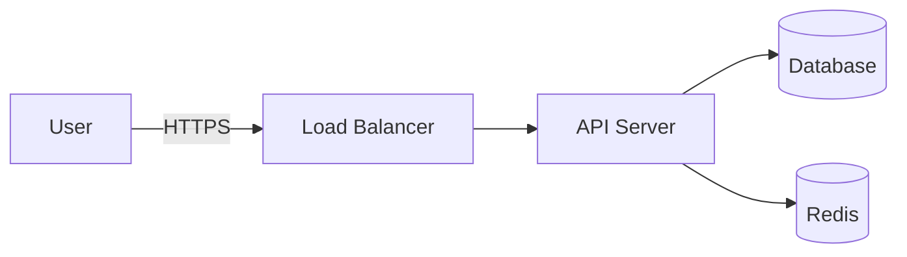

# Security Report Patterns

This reference provides templates and patterns for security assessments, vulnerability reports, and threat modeling documentation.

## Vulnerability Report

### Standard Template

```markdown
# VULNERABILITY REPORT

**Report ID**: VR-[YYYY]-[XXX]
**Date**: [YYYY-MM-DD]
**Severity**: [Critical/High/Medium/Low]
**Status**: [Open/In Progress/Resolved/Accepted Risk]
**CVSS Score**: [X.X] ([Vector String])

## Executive Summary

[2-3 sentence summary of vulnerability and impact]

## Vulnerability Details

### Description
[Detailed description of the vulnerability]

### Affected Systems
- **System/Application**: [Name and version]
- **Component**: [Specific affected component]
- **Environment**: [Production/Staging/Development]

### Vulnerability Type
- **Category**: [OWASP Top 10 / CWE Classification]
- **CWE ID**: CWE-[XXX]
- **OWASP**: [e.g., A01:2021 – Broken Access Control]

## CVSS v3.1 Scoring

**Base Score**: [X.X] [Critical/High/Medium/Low]
**Vector String**: CVSS:3.1/AV:[N/A/L/P]/AC:[L/H]/PR:[N/L/H]/UI:[N/R]/S:[U/C]/C:[H/L/N]/I:[H/L/N]/A:[H/L/N]

### Metric Breakdown
| Metric | Value | Justification |
|--------|-------|---------------|
| Attack Vector (AV) | Network | Exploitable remotely over the network |
| Attack Complexity (AC) | Low | No special conditions required |
| Privileges Required (PR) | None | No authentication needed |
| User Interaction (UI) | None | Fully automated exploit |
| Scope (S) | Unchanged | Affects only the vulnerable component |
| Confidentiality (C) | High | Total information disclosure |
| Integrity (I) | High | Complete data modification possible |
| Availability (A) | High | Complete system shutdown possible |

## Technical Analysis

### Root Cause
[Technical explanation of why the vulnerability exists]

### Attack Vector
[Step-by-step description of how the vulnerability can be exploited]

### Proof of Concept

**Prerequisites**:
- [Requirement 1]
- [Requirement 2]

**Exploitation Steps**:
1. [Step 1]
   ```bash
   curl -X POST https://example.com/api/vulnerable \
     -H "Content-Type: application/json" \
     -d '{"malicious": "payload"}'
   ```

2. [Step 2]
   [Expected result]

3. [Step 3]
   [Verification of successful exploitation]

**Evidence**:
- [Screenshot/log file showing exploitation]
- [Network capture if applicable]

## Impact Assessment

### Business Impact
- **Confidentiality**: [Impact on data confidentiality]
- **Integrity**: [Impact on data integrity]
- **Availability**: [Impact on system availability]

### Risk Score
| Factor | Score (1-5) | Justification |
|--------|-------------|---------------|
| Likelihood | [X] | [Why this likelihood] |
| Impact | [X] | [Why this impact] |
| **Total Risk** | **[X/25]** | |

### Affected Assets
- [Asset 1 - e.g., Customer database]
- [Asset 2 - e.g., Payment processing system]

### Compliance Impact
- **GDPR**: [Impact on personal data protection]
- **PCI-DSS**: [Impact on payment card data]
- **SOC 2**: [Impact on security controls]

## Remediation

### Recommended Fix
[Detailed remediation steps]

**Implementation**:
```python
# Example secure implementation
def secure_function(user_input):
    # Validate and sanitize input
    sanitized = sanitize_input(user_input)
    # Use parameterized queries
    query = "SELECT * FROM users WHERE id = ?"
    result = db.execute(query, (sanitized,))
    return result
```

### Workaround (Temporary)
[Temporary mitigation if full fix is not immediately available]

### Verification Steps
1. [How to verify the fix is effective]
2. [Testing procedures]

### Timeline
- **Discovery**: [YYYY-MM-DD]
- **Reported**: [YYYY-MM-DD]
- **Target Fix**: [YYYY-MM-DD]
- **Verification**: [YYYY-MM-DD]
- **Deployed**: [YYYY-MM-DD]

## References

### Related Vulnerabilities
- CVE-[YYYY]-[XXXXX]
- CWE-[XXX]

### External Resources
- [OWASP documentation]
- [Vendor security advisory]
- [Research papers or blog posts]

---

**Reported by**: [Name/Team]
**Reviewed by**: [Name/Team]
**Approved by**: [Security Lead]
```

## Threat Modeling Document (STRIDE)

### Template

```markdown
# THREAT MODEL: [System/Feature Name]

**Version**: [X.Y]
**Date**: [YYYY-MM-DD]
**Status**: [Draft/Review/Final]
**Owner**: [Security Team/Architect]

## System Overview

### Description
[Brief description of the system or feature being modeled]

### Architecture Diagram


### Trust Boundaries
- **Boundary 1**: Internet → Corporate Network
- **Boundary 2**: Application Layer → Database Layer
- **Boundary 3**: User Context → Admin Context

### Assets
1. **Customer PII** (High value)
   - Names, email addresses, phone numbers
   - Stored in PostgreSQL database

2. **Payment Information** (Critical value)
   - Credit card tokens
   - Stored in PCI-compliant vault

3. **Authentication Tokens** (High value)
   - JWT tokens
   - Short-lived (15 min)

## Threat Analysis (STRIDE)

### Spoofing Identity

#### Threat S1: JWT Token Theft
**Description**: Attacker steals JWT token from browser storage
**STRIDE Category**: Spoofing
**Affected Assets**: User sessions, Customer PII
**Attack Vector**: XSS vulnerability → localStorage access
**Risk Score**: High (Likelihood: 4/5, Impact: 4/5)

**Mitigations**:
- ✅ Implemented: HTTPOnly cookies (not localStorage)
- ✅ Implemented: SameSite=Strict cookie attribute
- ⚠️ Planned: CSRF tokens for state-changing operations
- ❌ Not applicable: Short token lifetime (already 15 min)

**Residual Risk**: Medium

---

#### Threat S2: Session Hijacking
[Same structure...]

### Tampering with Data

#### Threat T1: SQL Injection
**Description**: Attacker modifies database queries through unsanitized input
**STRIDE Category**: Tampering
**Affected Assets**: Database integrity, Customer PII
**Attack Vector**: User input → SQL query without parameterization
**Risk Score**: Critical (Likelihood: 5/5, Impact: 5/5)

**Mitigations**:
- ✅ Implemented: Parameterized queries (ORM)
- ✅ Implemented: Input validation with whitelist
- ✅ Implemented: Database user with minimum privileges
- ✅ Implemented: WAF with SQL injection rules

**Residual Risk**: Low

### Repudiation

#### Threat R1: Action Without Audit Trail
[Structure as above...]

### Information Disclosure

#### Threat I1: Sensitive Data in Logs
[Structure as above...]

### Denial of Service

#### Threat D1: API Rate Limit Bypass
[Structure as above...]

### Elevation of Privilege

#### Threat E1: Admin Function Access
[Structure as above...]

## Summary

### Threat Statistics
- **Total Threats Identified**: [X]
- **Critical**: [X]
- **High**: [X]
- **Medium**: [X]
- **Low**: [X]

### Mitigation Status
- ✅ **Implemented**: [X] threats
- ⚠️ **Planned**: [X] threats
- ❌ **Accepted Risk**: [X] threats

### Risk Acceptance

Threats accepted as residual risk:
1. **Threat ID**: [S3 - Brute Force Login]
   **Justification**: Rate limiting reduces likelihood to acceptable level
   **Accepted by**: [Security Lead Name]
   **Date**: [YYYY-MM-DD]

---

**Prepared by**: [Security Team]
**Reviewed by**: [Architecture Team]
**Approved by**: [CISO]
```

## Penetration Test Report

### Executive Summary Template

```markdown
# PENETRATION TEST REPORT

**Client**: [Company Name]
**Test Period**: [Start Date] to [End Date]
**Report Date**: [YYYY-MM-DD]
**Version**: [X.Y]

## Executive Summary

### Engagement Overview
[Brief description of the penetration testing engagement]

**Scope**:
- Web Application: https://example.com
- API Endpoints: https://api.example.com/*
- Mobile Application: iOS/Android

**Methodology**:
- OWASP Testing Guide v4.2
- PTES (Penetration Testing Execution Standard)
- Manual testing + automated scanning

### Key Findings

**Critical**: [X] findings
**High**: [X] findings
**Medium**: [X] findings
**Low**: [X] findings
**Informational**: [X] findings

### Risk Posture

**Overall Risk Rating**: [High/Medium/Low]

[Visual risk matrix - can be described or referenced as image]

### Top 5 Critical Issues

1. **SQL Injection in Login Form** (CVSS: 9.8)
   - Full database access possible
   - Immediate remediation required

2. **Broken Authentication** (CVSS: 9.1)
   - Session fixation vulnerability
   - High priority fix

3. **[Issue 3]** (CVSS: [X.X])
   [Brief description]

4. **[Issue 4]** (CVSS: [X.X])
   [Brief description]

5. **[Issue 5]** (CVSS: [X.X])
   [Brief description]

### Recommendations Priority

**Immediate (Within 7 days)**:
- Fix SQL injection vulnerabilities
- Implement strong session management

**Short-term (Within 30 days)**:
- Implement CSRF protection
- Enable security headers
- Fix XSS vulnerabilities

**Long-term (Within 90 days)**:
- Implement security code review process
- Deploy WAF
- Conduct security training for developers

## Detailed Findings

### Finding 1: SQL Injection in Login Form

**Severity**: Critical
**CVSS Score**: 9.8
**Vector**: CVSS:3.1/AV:N/AC:L/PR:N/UI:N/S:U/C:H/I:H/A:H

**Affected URL**: https://example.com/login
**Parameter**: username

**Description**:
The login form is vulnerable to SQL injection. The username parameter is not properly sanitized, allowing an attacker to manipulate SQL queries.

**Proof of Concept**:
```sql
Username: admin' OR '1'='1' --
Password: anything

Resulting query:
SELECT * FROM users WHERE username='admin' OR '1'='1' --' AND password='...'
```

**Impact**:
- Complete database access
- User credential theft
- Data modification/deletion
- Potential server compromise

**Remediation**:
```python
# Vulnerable code
query = f"SELECT * FROM users WHERE username='{username}' AND password='{password}'"

# Secure code
query = "SELECT * FROM users WHERE username=? AND password=?"
cursor.execute(query, (username, hashed_password))
```

**References**:
- OWASP A03:2021 – Injection
- CWE-89: SQL Injection

---

[Additional findings following same structure...]

## Testing Methodology

### Reconnaissance
- DNS enumeration
- WHOIS lookup
- Subdomain discovery
- Technology fingerprinting

### Vulnerability Scanning
- Automated scanning (Burp Suite, OWASP ZAP)
- Dependency vulnerability scanning
- SSL/TLS configuration review

### Manual Testing
- Authentication testing
- Authorization testing
- Session management testing
- Input validation testing
- Business logic testing

### Exploitation
- Proof of concept development
- Impact demonstration
- Post-exploitation analysis

## Appendices

### Appendix A: Vulnerability Details
[Complete list of all findings with technical details]

### Appendix B: Testing Tools
- Burp Suite Professional v2024.X
- OWASP ZAP v2.XX
- Nmap v7.XX
- SQLMap v1.XX

### Appendix C: Scope Documentation
[Detailed scope including IP ranges, domains, accounts provided]

---

**Prepared by**: [Penetration Testing Team]
**Quality Reviewed by**: [Senior Pentester]
**Date**: [YYYY-MM-DD]
```

## Security Assessment Summary

### Quick Reference Template

```markdown
# SECURITY ASSESSMENT SUMMARY

**System**: [Name]
**Date**: [YYYY-MM-DD]
**Assessor**: [Name/Team]

## Risk Score: [X/100]

### Vulnerability Breakdown

| Severity | Count | % of Total |
|----------|-------|------------|
| Critical | [X] | [XX]% |
| High | [X] | [XX]% |
| Medium | [X] | [XX]% |
| Low | [X] | [XX]% |
| Info | [X] | [XX]% |

### Compliance Status

| Standard | Status | Notes |
|----------|--------|-------|
| OWASP Top 10 | ⚠️ Partial | 3/10 categories need attention |
| GDPR | ✅ Compliant | Data protection controls verified |
| PCI-DSS | ❌ Non-compliant | Missing encryption at rest |

### Top Risks

1. **[Risk 1]** - Remediate by [Date]
2. **[Risk 2]** - Remediate by [Date]
3. **[Risk 3]** - Remediate by [Date]

### Action Items

**Critical (This Week)**:
- [ ] Fix SQL injection in login
- [ ] Implement input validation

**High (This Month)**:
- [ ] Deploy WAF
- [ ] Enable security headers

**Medium (This Quarter)**:
- [ ] Security training
- [ ] Code review process
```

## Incident Response Report

### Template

```markdown
# SECURITY INCIDENT REPORT

**Incident ID**: IR-[YYYY]-[XXX]
**Date Detected**: [YYYY-MM-DD HH:MM UTC]
**Date Resolved**: [YYYY-MM-DD HH:MM UTC]
**Severity**: [Critical/High/Medium/Low]
**Status**: [Open/Contained/Resolved/Closed]

## Executive Summary
[2-3 paragraph summary of the incident]

## Incident Details

### Detection
**Detection Method**: [IDS Alert/User Report/Log Analysis]
**Detection Time**: [YYYY-MM-DD HH:MM UTC]
**Detected By**: [Team/System]

### Classification
**Incident Type**: [Data Breach/Malware/DDoS/Unauthorized Access]
**NIST Category**: [Attrition/Web/Email/Impersonation/Improper Usage/Equipment Loss/Unknown]

### Timeline

| Time (UTC) | Event |
|------------|-------|
| 2025-11-08 10:23 | Initial compromise detected |
| 2025-11-08 10:30 | Incident response team notified |
| 2025-11-08 10:45 | Affected systems isolated |
| 2025-11-08 11:00 | Root cause identified |
| 2025-11-08 12:00 | Vulnerability patched |
| 2025-11-08 14:00 | Systems restored |

## Impact Analysis

### Affected Systems
- [System 1: Database server (db-prod-01)]
- [System 2: API server (api-prod-03)]

### Data Exposure
- **Records Affected**: [X,XXX] customer records
- **Data Types**: Email addresses, phone numbers
- **Sensitivity**: PII (no payment data)

### Business Impact
- **Downtime**: [X] hours
- **Revenue Impact**: EUR [X,XXX]
- **Reputation Impact**: [Assessment]

## Root Cause Analysis

### Attack Vector
[Detailed description of how the attacker gained access]

### Vulnerabilities Exploited
1. **CVE-2024-XXXXX**: Unpatched Apache Struts
2. **Weak Credentials**: Default admin password

### Security Control Failures
- Missing intrusion detection on subnet X
- Delayed patch management process

## Response Actions

### Containment
1. Isolated affected servers from network
2. Disabled compromised user accounts
3. Blocked attacker IP addresses at firewall

### Eradication
1. Removed malware from affected systems
2. Patched vulnerabilities (CVE-2024-XXXXX)
3. Reset all administrative passwords

### Recovery
1. Restored systems from clean backups
2. Verified system integrity
3. Monitored for 48 hours post-recovery

## Lessons Learned

### What Went Well
- Quick detection (23 minutes)
- Effective isolation
- Clear communication

### What Went Wrong
- Patch management delay
- Insufficient network segmentation

### Improvements
1. **Action**: Implement automated patch management
   **Owner**: IT Operations
   **Target**: [YYYY-MM-DD]

2. **Action**: Deploy IDS on all production subnets
   **Owner**: Security Team
   **Target**: [YYYY-MM-DD]

## Notification

### Regulatory Reporting
- **GDPR**: Reported to DPA within 72 hours (2025-11-10)
- **NIS Directive**: Notification sent (2025-11-09)

### Customer Notification
- **Date**: [YYYY-MM-DD]
- **Method**: Email to affected users
- **Recipients**: [X,XXX] customers

---

**Prepared by**: [Incident Response Team]
**Reviewed by**: [CISO]
**Approved by**: [CEO]
```
